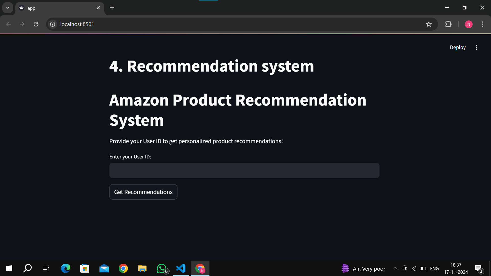
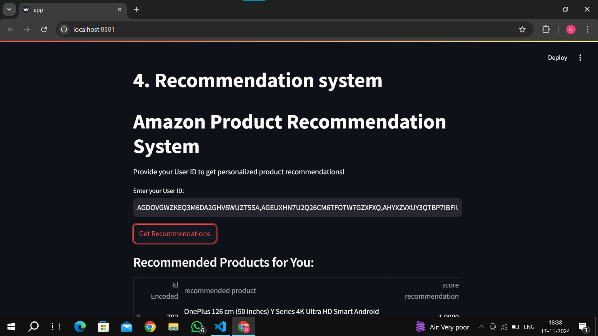
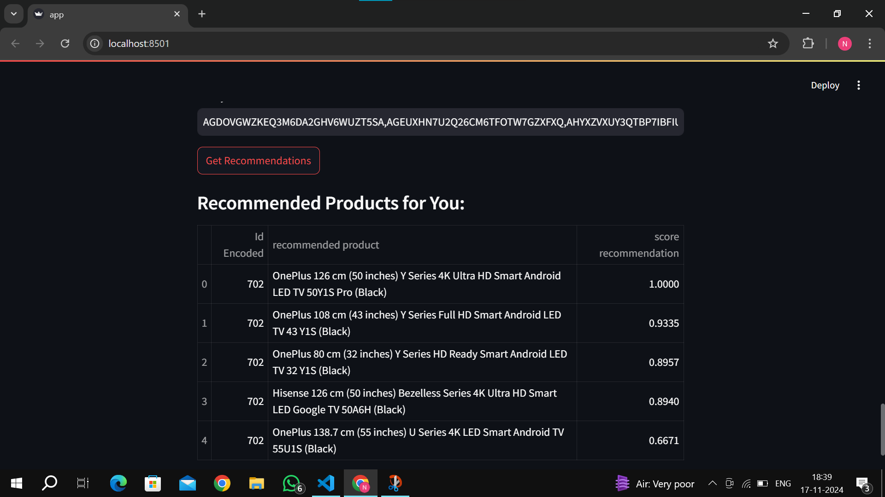

# ShopSmart
A Smart Product Recommendation System

---

# **Amazon Product Recommendation System**

### **Table of Contents**
1. [Overview](#overview)  
2. [Features](#features)  
3. [Installation](#installation)  
4. [Dataset](#dataset)  
5. [Workflow](#workflow)  
6. [Model Description](#model-description)  
7. [Streamlit Web App](#streamlit-web-app)  
8. [Results and Insights](#results-and-insights)  
9. [Technologies Used](#technologies-used)  
10. [Future Enhancements](#future-enhancements)

---

### **Overview**
This project develops a **product recommendation system** based on customer purchasing history and product features. The system recommends products using **content-based filtering** by analyzing textual product descriptions.

---

### **Features**
- **Preprocessing:** Handles missing values, duplicates, and feature engineering for clean data.  
- **Exploratory Data Analysis (EDA):** Visualizes product distribution, customer ratings, and discount patterns.  
- **Recommendation System:** Suggests products based on textual similarities in product descriptions.  
- **Interactive Streamlit App:** Allows users to receive personalized recommendations based on their ID.

---

### **Installation**
1. Clone the repository:  
   ```bash
   git clone https://github.com/ShopSmart
   cd ShopSmart
   ```
2. Install required dependencies:  
   ```bash
   pip install -r requirements.txt
   ```
3. Run the Streamlit app:  
   ```bash
   streamlit run app.py
   ```

---

### **Dataset**
- The dataset consists of various attributes such as product categories, prices, ratings, and reviews.  
- Preprocessed to handle anomalies like non-standard characters in numerical columns, and engineered features like weighted ratings.

---

### **Workflow**

#### **1. Data Collection**
- Imported dataset from CSV file for analysis.  
- Initial inspection of shape, structure, and missing data.  

#### **2. Data Preprocessing**
- Identified and handled:
  - Missing values in `rating_count`.
  - Incorrect characters in numerical fields.  
- Created new features:  
  - `rating_weighted` (rating × count).  
  - `main_category` and `sub_category` from category hierarchy.  

#### **3. Exploratory Data Analysis (EDA)**
- Visualized product distributions by category.  
- Analyzed discount percentages and their correlation with ratings.  
- Identified trends in high-performing and low-performing categories.  
- Generated word clouds from customer reviews for insights.

#### **4. Model Development**
- **Recommendation System**: Utilizes TF-IDF for feature extraction and cosine similarity for matching products based on textual descriptions.  

#### **5. Deployment**
- Built a **Streamlit Web App** for real-time user interaction and recommendations.

---

### **Model Description**
- **Content-Based Filtering**:  
  - Calculates similarity between product descriptions using TF-IDF.  
  - Recommends products similar to the user's past purchases.

- **Key Features Used**:
  - `about_product` (Product description).  
  - Encoded `user_id` for user identification.

---

### **Streamlit Web App**
#### **Features**:
- Input User ID to generate recommendations.  
- Outputs a table of recommended products with similarity scores.  

#### **How to Use**:
1. Enter a valid User ID.  
2. Click **Get Recommendations** to view personalized product suggestions.

---

### **Results and Insights**
#### **EDA Insights**:
- **Category Popularity**:
  - Electronics and Computers dominate product availability.  
- **Rating Trends**:
  - Office Products and Toys rank highest in average ratings.  
- **Discount Patterns**:
  - Home Improvement offers the highest average discounts.

#### **Recommendation Examples**:
- The system successfully recommends related products based on content similarity.





---

### **Technologies Used**
- **Python Libraries**:
  - `pandas`, `numpy` for data manipulation.  
  - `matplotlib`, `seaborn` for visualizations.  
  - `sklearn` for machine learning tasks.  
  - `streamlit` for app deployment.  
- **NLP Tools**: TF-IDF for feature extraction.  

---

### **Future Enhancements**
- Incorporate collaborative filtering for improved recommendations.  
- Add sentiment analysis from customer reviews to enhance recommendations.  
- Optimize computational efficiency for large datasets.  

---

